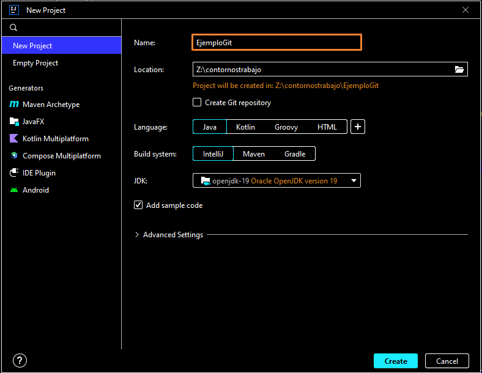

# Pasos realizados

1. Creación de un proyecto en IntelliJ



2. Primer commit:

```bash
$ git init
$ git add .
$ git commit -m "creo un proyecto limpio con IntelliJ"
```

[Completar con los pasos para reproducir este proyecto con los mismos commits y subirlo a un rep
